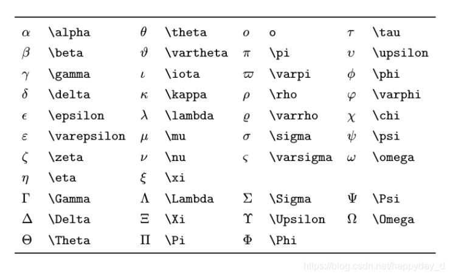
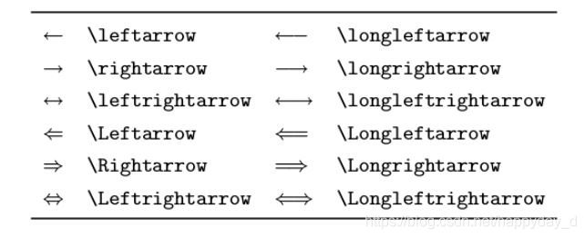

## LaTeX 编辑数学公式基本语法元素

数学公式有两种形式： inline 和 display

- inline(行间公式):在正文插入数学公式，用$...$ 将公式括起来

- display(块间公式):独立排列的公式，用 $$...$$将公式括起来，默认显示在行中间

- 各类希腊字母表：

  eg: $\alpha$

### 上下标、根号、省略号

- **下标：_ **   eg: $x_i$

- **上标：**^   eg: $ x^2$ 

  注意：上下标如果多于一个字母或者符号，需要用一对{}括起来 eg： $x_{i1}$

- **根号：\sqrt** eg: $\sqrt[n]{5}$

- **省略号：\dots  \cdots** 分别表示  $\dots$  $\cdots$

- **字符下标**: $\max \limits_{a<x<b}\{f(x)\}$

### 运算符

**基本运算符**： $\div$ $\pm$

-  **求和**  $\sum_1^n$
- **积分**  $\int_1^n$
- **极限**  $\lim_{x \to \infty}$

- **分数**  $\frac{3}{8}$

- **矩阵和行列式**

  矩阵： `$$\begin{matrix}...\end{matrix}$$`, 其中使用&分隔同行元素，\换行 
  $$
  \begin{matrix} 1 & x & x^2\\ 1 & y & y^2\\ 1 & z & z^2\\ \end{matrix}
  $$
  行列式:
  $$
  X = \left|
  	\begin{matrix}
  		x_{11} & x_{12} & \cdots & x_{1d} \\
          	 x_{21} & x_{22} & \cdots & x_{2d} \\
          	 \vdots & \vdots  & \cdots & \vdots  \\
               	x_{n1} & x_{n2} & \cdots & x_{nd} \\
  	\end{matrix}
  \right|
  $$

- **分隔符**

  ​	各种括号用 () [] { } \langle\rangle 等命令表示,注意花括号通常用来输入命令和环境的参数,所以在数学公式中它们前面要加 \。可以在上述分隔符前面加 \big \Big \bigg \Bigg 等命令来调整大小。 

- **箭头**

  $\downarrow$

  

- 方程式

  $E = mc^2$

- 分段函数
  $$
  f(n) = 
  	\begin{cases}
  		n/2, & \text{if $n$ is  even} \\
  		3n+1,& \text{if $n$ is odd} \\
  	\end{cases}
  $$

- 方程组
  $$
  \left\{
  	\begin{array}{c}
  		a_1x + b_1y + c_1z = d_1 \\
  		a_2x + b_2y + c_2z = d_2 \\
  		a_3x + b_3y + c_2z = d_3
  	\end{array}
  \right.
  $$

### 常用公式

- **线性模型**
  $$
  h(\theta) = \sum_{j = 0} ^ n \theta_j x_j
  $$

- 均方误差
  $$
  J(\theta) = \frac{1}{2m} \sum_{i = 0}^m (y^i - h_\theta(x^i))^2
  $$

- 求积公式
  $$
  H_c = \sum_{l_1+\cdots+l_p} \prod^p_{i=1} \binom{n_i}{l_i}
  $$

- 批量梯度下降
  $$
  \frac{\partial J(\theta)}{\partial{\theta_j}} = -\frac{1}{m}\sum_{i=0}{m}(y^i - h_{\theta}(x^i))x_j^i
  $$

- 推导过程

  

$$
\begin{align}
	\frac{\partial J(\theta)}{\partial\theta_j}
	& = -\frac1m\sum_{i=0}^m(y^i - h_\theta(x^i)) \frac{\partial}{\partial\theta_j}(y^i-h_\theta(x^i))\\
	& = -\frac1m\sum_{i=0}^m(y^i-h_\theta(x^i)) \frac{\partial}{\partial\theta_j}(\sum_{j=0}^n\theta_j x^i_j-y^i)\\
	&=-\frac1m\sum_{i=0}^m(y^i -h_\theta(x^i)) x^i_j
\end{align}
$$

